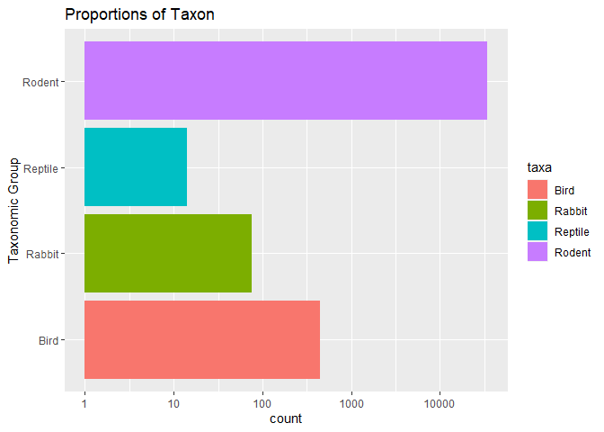
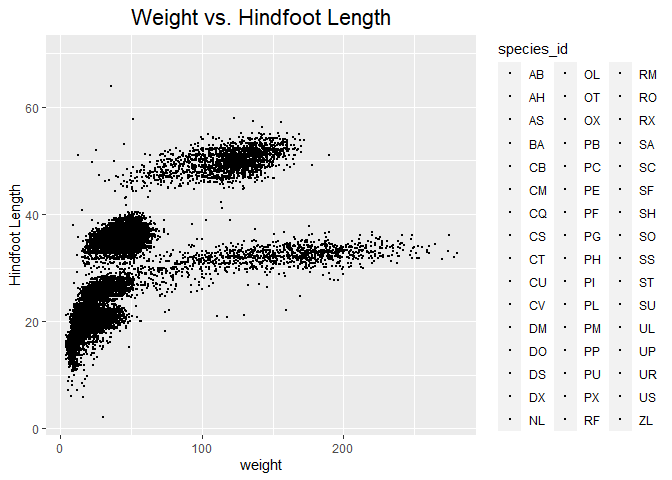
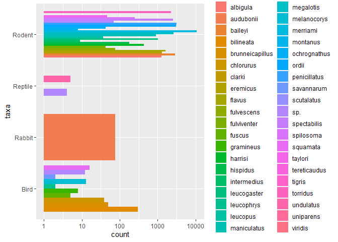

## Instructions
Answer the following questions and complete the exercises in RMarkdown. Please embed all of your code and push your final work to your repository. Your final lab report should be organized, clean, and run free from errors. Remember, you must remove the `#` for the included code chunks to run. Be sure to add your name to the author header above. For any included plots, make sure they are clearly labeled. You are free to use any plot type that you feel best communicates the results of your analysis.  

Make sure to use the formatting conventions of RMarkdown to make your report neat and clean!  

## Load the libraries

```r
library(tidyverse)
library(janitor)
library(naniar)
```

## Desert Ecology
For this assignment, we are going to use a modified data set on [desert ecology](http://esapubs.org/archive/ecol/E090/118/). The data are from: S. K. Morgan Ernest, Thomas J. Valone, and James H. Brown. 2009. Long-term monitoring and experimental manipulation of a Chihuahuan Desert ecosystem near Portal, Arizona, USA. Ecology 90:1708.

```r
deserts <- read_csv("data/surveys_complete.csv") %>% clean_names()
```

```
## Rows: 34786 Columns: 13
## ── Column specification ────────────────────────────────────────────────────────
## Delimiter: ","
## chr (6): species_id, sex, genus, species, taxa, plot_type
## dbl (7): record_id, month, day, year, plot_id, hindfoot_length, weight
## 
## ℹ Use `spec()` to retrieve the full column specification for this data.
## ℹ Specify the column types or set `show_col_types = FALSE` to quiet this message.
```

1. Use the function(s) of your choice to get an idea of its structure, including how NA's are treated. Are the data tidy?  

```r
glimpse(deserts)
```

```
## Rows: 34,786
## Columns: 13
## $ record_id       <dbl> 1, 2, 3, 4, 5, 6, 7, 8, 9, 10, 11, 12, 13, 14, 15, 16,…
## $ month           <dbl> 7, 7, 7, 7, 7, 7, 7, 7, 7, 7, 7, 7, 7, 7, 7, 7, 7, 7, …
## $ day             <dbl> 16, 16, 16, 16, 16, 16, 16, 16, 16, 16, 16, 16, 16, 16…
## $ year            <dbl> 1977, 1977, 1977, 1977, 1977, 1977, 1977, 1977, 1977, …
## $ plot_id         <dbl> 2, 3, 2, 7, 3, 1, 2, 1, 1, 6, 5, 7, 3, 8, 6, 4, 3, 2, …
## $ species_id      <chr> "NL", "NL", "DM", "DM", "DM", "PF", "PE", "DM", "DM", …
## $ sex             <chr> "M", "M", "F", "M", "M", "M", "F", "M", "F", "F", "F",…
## $ hindfoot_length <dbl> 32, 33, 37, 36, 35, 14, NA, 37, 34, 20, 53, 38, 35, NA…
## $ weight          <dbl> NA, NA, NA, NA, NA, NA, NA, NA, NA, NA, NA, NA, NA, NA…
## $ genus           <chr> "Neotoma", "Neotoma", "Dipodomys", "Dipodomys", "Dipod…
## $ species         <chr> "albigula", "albigula", "merriami", "merriami", "merri…
## $ taxa            <chr> "Rodent", "Rodent", "Rodent", "Rodent", "Rodent", "Rod…
## $ plot_type       <chr> "Control", "Long-term Krat Exclosure", "Control", "Rod…
```


```r
str(deserts)
```

```
## spc_tbl_ [34,786 × 13] (S3: spec_tbl_df/tbl_df/tbl/data.frame)
##  $ record_id      : num [1:34786] 1 2 3 4 5 6 7 8 9 10 ...
##  $ month          : num [1:34786] 7 7 7 7 7 7 7 7 7 7 ...
##  $ day            : num [1:34786] 16 16 16 16 16 16 16 16 16 16 ...
##  $ year           : num [1:34786] 1977 1977 1977 1977 1977 ...
##  $ plot_id        : num [1:34786] 2 3 2 7 3 1 2 1 1 6 ...
##  $ species_id     : chr [1:34786] "NL" "NL" "DM" "DM" ...
##  $ sex            : chr [1:34786] "M" "M" "F" "M" ...
##  $ hindfoot_length: num [1:34786] 32 33 37 36 35 14 NA 37 34 20 ...
##  $ weight         : num [1:34786] NA NA NA NA NA NA NA NA NA NA ...
##  $ genus          : chr [1:34786] "Neotoma" "Neotoma" "Dipodomys" "Dipodomys" ...
##  $ species        : chr [1:34786] "albigula" "albigula" "merriami" "merriami" ...
##  $ taxa           : chr [1:34786] "Rodent" "Rodent" "Rodent" "Rodent" ...
##  $ plot_type      : chr [1:34786] "Control" "Long-term Krat Exclosure" "Control" "Rodent Exclosure" ...
##  - attr(*, "spec")=
##   .. cols(
##   ..   record_id = col_double(),
##   ..   month = col_double(),
##   ..   day = col_double(),
##   ..   year = col_double(),
##   ..   plot_id = col_double(),
##   ..   species_id = col_character(),
##   ..   sex = col_character(),
##   ..   hindfoot_length = col_double(),
##   ..   weight = col_double(),
##   ..   genus = col_character(),
##   ..   species = col_character(),
##   ..   taxa = col_character(),
##   ..   plot_type = col_character()
##   .. )
##  - attr(*, "problems")=<externalptr>
```

```r
naniar::miss_var_summary(deserts)
```

```
## # A tibble: 13 × 3
##    variable        n_miss pct_miss
##    <chr>            <int>    <dbl>
##  1 hindfoot_length   3348     9.62
##  2 weight            2503     7.20
##  3 sex               1748     5.03
##  4 record_id            0     0   
##  5 month                0     0   
##  6 day                  0     0   
##  7 year                 0     0   
##  8 plot_id              0     0   
##  9 species_id           0     0   
## 10 genus                0     0   
## 11 species              0     0   
## 12 taxa                 0     0   
## 13 plot_type            0     0
```

The data appears to be tidy.


2. How many genera and species are represented in the data? What are the total number of observations? Which species is most/ least frequently sampled in the study?

```r
deserts %>% 
  count(species) %>% 
  arrange(desc(n)) %>% 
  top_n(-10, n)
```

```
## # A tibble: 10 × 2
##    species          n
##    <chr>        <int>
##  1 fuscus           5
##  2 undulatus        5
##  3 leucophrys       2
##  4 savannarum       2
##  5 clarki           1
##  6 scutalatus       1
##  7 tereticaudus     1
##  8 tigris           1
##  9 uniparens        1
## 10 viridis          1
```
There are 10 species represented. Merriami is sampled the most, and 6 species are only sampled once, with viridis at the bottom.


```r
deserts %>% 
  count(genus)
```

```
## # A tibble: 26 × 2
##    genus                n
##    <chr>            <int>
##  1 Ammodramus           2
##  2 Ammospermophilus   437
##  3 Amphispiza         303
##  4 Baiomys             46
##  5 Calamospiza         13
##  6 Callipepla          16
##  7 Campylorhynchus     50
##  8 Chaetodipus       6029
##  9 Cnemidophorus        2
## 10 Crotalus             2
## # ℹ 16 more rows
```
There are 10 genera represented.


3. What is the proportion of taxa included in this study? Show a table and plot that reflects this count.

```r
deserts %>% 
  ggplot(aes(x=taxa, fill=taxa))+
  geom_bar()+
  coord_flip()+
  labs(title="Proportions of Taxon", x="Taxonomic Group")+
  scale_y_log10()
```

<!-- -->


4. For the taxa included in the study, use the fill option to show the proportion of individuals sampled by `plot_type.`

```r
deserts %>% 
  ggplot(aes(x=taxa, fill=plot_type))+
  geom_bar(position="dodge")+
  coord_flip()+
  labs(title="Proportions of Taxon", x="Taxonomic Group")+
  scale_y_log10()
```

<!-- -->


5. What is the range of weight for each species included in the study? Remove any observations of weight that are NA so they do not show up in the plot.

```r
deserts %>% 
  ggplot(aes(x=species, y=weight, na.rm=T))+
  geom_boxplot()+
  coord_flip()+
  labs(title="Weight per Species", x="Species")+
  scale_y_log10()
```

```
## Warning: Removed 2503 rows containing non-finite values (`stat_boxplot()`).
```

<!-- -->

```r
#?? weird layout and cant tell if I did it correctly/removed NAs
```


6. Add another layer to your answer from #5 using `geom_point` to get an idea of how many measurements were taken for each species.

```r
deserts %>% 
  ggplot(aes(x=species, y=weight, na.rm=T))+
  geom_boxplot()+
  coord_flip()+
  labs(title="Weight per Species", x="Species")+
  scale_y_log10()+
  geom_point()
```

```
## Warning: Removed 2503 rows containing non-finite values (`stat_boxplot()`).
```

```
## Warning: Removed 2503 rows containing missing values (`geom_point()`).
```

<!-- -->

```r
#?
```


7. [Dipodomys merriami](https://en.wikipedia.org/wiki/Merriam's_kangaroo_rat) is the most frequently sampled animal in the study. How have the number of observations of this species changed over the years included in the study?

```r
deserts %>% 
  filter(species== "merriami") %>% 
  ggplot(aes(x=year))+
    geom_bar()
```

<!-- -->

```r
#?
```


8. What is the relationship between `weight` and `hindfoot` length? Consider whether or not over plotting is an issue.

```r
deserts %>% 
  ggplot(aes(x=weight, y=hindfoot_length, fill=species_id))+
  geom_jitter(na.rm=T, size=0.25)+
  labs(title="Weight vs. Hindfoot Length", y="Hindfoot Length")+
  theme(plot.title = element_text(size=rel(1.5), hjust = 0.5))
```

<!-- -->

```r
#? fill function didnt work
```
Overplotting could be an issue, since it makes it harder to analyze the graph.


9. Which two species have, on average, the highest weight? Once you have identified them, make a new column that is a ratio of `weight` to `hindfoot_length`. Make a plot that shows the range of this new ratio and fill by sex.

```r
deserts %>% 
  filter(weight!= "NA") %>% 
  group_by(species_id) %>% 
  summarise(mean_weight=mean(weight)) %>% 
  arrange(desc(mean_weight)) #identified species with highest weight
```

```
## # A tibble: 25 × 2
##    species_id mean_weight
##    <chr>            <dbl>
##  1 NL               159. 
##  2 DS               120. 
##  3 SS                93.5
##  4 SH                73.1
##  5 SF                58.9
##  6 SO                55.4
##  7 DO                48.9
##  8 DM                43.2
##  9 PB                31.7
## 10 OL                31.6
## # ℹ 15 more rows
```

```r
  #top_n(2, highest_weight) %>% 
  #ggplot(aes(x=highest_weight, y=hindfoot_length))+
  #geom_boxplot()
#? how to make a new column for ratio
```

```r
deserts %>% 
  filter(species_id=="NL"|species_id=="DS") %>% 
  filter(weight!="NA"|hindfoot_length!="NA") %>% 
  mutate(ratio=weight/hindfoot_length) %>% 
  select(species_id, sex, weight, hindfoot_length, ratio)
```

```
## # A tibble: 3,630 × 5
##    species_id sex   weight hindfoot_length ratio
##    <chr>      <chr>  <dbl>           <dbl> <dbl>
##  1 NL         M         NA              32    NA
##  2 NL         M         NA              33    NA
##  3 DS         F         NA              53    NA
##  4 DS         F         NA              48    NA
##  5 DS         F         NA              48    NA
##  6 NL         F         NA              31    NA
##  7 DS         F         NA              52    NA
##  8 NL         M         NA              33    NA
##  9 DS         F         NA              46    NA
## 10 DS         M         NA              45    NA
## # ℹ 3,620 more rows
```

```r
deserts %>% 
  filter(species_id=="NL"|species_id=="DS") %>% 
  filter(weight!="NA"& hindfoot_length!="NA" & sex!="NA") %>% 
  mutate(ratio=weight/hindfoot_length) %>% 
  select(species_id, sex, weight, hindfoot_length, ratio) #%>% 
```

```
## # A tibble: 3,068 × 5
##    species_id sex   weight hindfoot_length ratio
##    <chr>      <chr>  <dbl>           <dbl> <dbl>
##  1 DS         F        117              50  2.34
##  2 DS         F        121              51  2.37
##  3 DS         M        115              51  2.25
##  4 DS         F        120              48  2.5 
##  5 DS         F        118              48  2.46
##  6 DS         F        126              52  2.42
##  7 DS         M        132              50  2.64
##  8 DS         F        122              53  2.30
##  9 DS         F        107              48  2.23
## 10 DS         F        115              50  2.3 
## # ℹ 3,058 more rows
```

```r
  #ggplot(aes(x=species_id, y=ratio, fill=sex))
#geom_boxplot()+
  #labs(title= "Range of Weight/ Hindfoot Length for Species NL and DS", 
       #x= "Species ID",
       #y="Weight/Hindfoot Length")
```


10. Make one plot of your choice! Make sure to include at least two of the aesthetics options you have learned.

```r
deserts %>% 
  ggplot(aes(x=taxa, fill=species))+
  geom_bar(position="dodge")+
  scale_y_log10()+
  coord_flip()
```

<!-- -->


## Push your final code to GitHub!
Please be sure that you check the `keep md` file in the knit preferences. 
