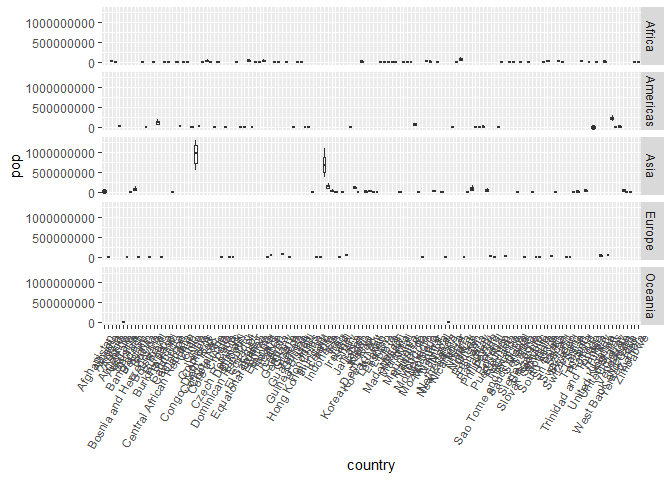

## Instructions
Answer the following questions and complete the exercises in RMarkdown. Please embed all of your code and push your final work to your repository. Your final lab report should be organized, clean, and run free from errors. Remember, you must remove the `#` for the included code chunks to run. Be sure to add your name to the author header above. For any included plots, make sure they are clearly labeled. You are free to use any plot type that you feel best communicates the results of your analysis.  

**In this homework, you should make use of the aesthetics you have learned. It's OK to be flashy!**

Make sure to use the formatting conventions of RMarkdown to make your report neat and clean!  

## Load the libraries

```r
library(tidyverse)
library(janitor)
library(here)
library(naniar)
```


```r
options(scipen = 999)
```

## Resources
The idea for this assignment came from [Rebecca Barter's](http://www.rebeccabarter.com/blog/2017-11-17-ggplot2_tutorial/) ggplot tutorial so if you get stuck this is a good place to have a look.  

## Gapminder
For this assignment, we are going to use the dataset [gapminder](https://cran.r-project.org/web/packages/gapminder/index.html). Gapminder includes information about economics, population, and life expectancy from countries all over the world. You will need to install it before use. This is the same data that we will use for midterm 2 so this is good practice.

```r
#install.packages("gapminder")
library("gapminder")
```

## Questions
The questions below are open-ended and have many possible solutions. Your approach should, where appropriate, include numerical summaries and visuals. Be creative; assume you are building an analysis that you would ultimately present to an audience of stakeholders. Feel free to try out different `geoms` if they more clearly present your results.  

**1. Use the function(s) of your choice to get an idea of the overall structure of the data frame, including its dimensions, column names, variable classes, etc. As part of this, determine how NAs are treated in the data.** 

```r
glimpse(gapminder)
```

```
## Rows: 1,704
## Columns: 6
## $ country   <fct> "Afghanistan", "Afghanistan", "Afghanistan", "Afghanistan", …
## $ continent <fct> Asia, Asia, Asia, Asia, Asia, Asia, Asia, Asia, Asia, Asia, …
## $ year      <int> 1952, 1957, 1962, 1967, 1972, 1977, 1982, 1987, 1992, 1997, …
## $ lifeExp   <dbl> 28.801, 30.332, 31.997, 34.020, 36.088, 38.438, 39.854, 40.8…
## $ pop       <int> 8425333, 9240934, 10267083, 11537966, 13079460, 14880372, 12…
## $ gdpPercap <dbl> 779.4453, 820.8530, 853.1007, 836.1971, 739.9811, 786.1134, …
```


```r
str(gapminder)
```

```
## tibble [1,704 × 6] (S3: tbl_df/tbl/data.frame)
##  $ country  : Factor w/ 142 levels "Afghanistan",..: 1 1 1 1 1 1 1 1 1 1 ...
##  $ continent: Factor w/ 5 levels "Africa","Americas",..: 3 3 3 3 3 3 3 3 3 3 ...
##  $ year     : int [1:1704] 1952 1957 1962 1967 1972 1977 1982 1987 1992 1997 ...
##  $ lifeExp  : num [1:1704] 28.8 30.3 32 34 36.1 ...
##  $ pop      : int [1:1704] 8425333 9240934 10267083 11537966 13079460 14880372 12881816 13867957 16317921 22227415 ...
##  $ gdpPercap: num [1:1704] 779 821 853 836 740 ...
```


```r
summary(gapminder_unfiltered)
```

```
##            country        continent         year         lifeExp     
##  Czech Republic:  58   Africa  : 637   Min.   :1950   Min.   :23.60  
##  Denmark       :  58   Americas: 470   1st Qu.:1967   1st Qu.:58.33  
##  Finland       :  58   Asia    : 578   Median :1982   Median :69.61  
##  Iceland       :  58   Europe  :1302   Mean   :1980   Mean   :65.24  
##  Japan         :  58   FSU     : 139   3rd Qu.:1996   3rd Qu.:73.66  
##  Netherlands   :  58   Oceania : 187   Max.   :2007   Max.   :82.67  
##  (Other)       :2965                                                 
##       pop               gdpPercap       
##  Min.   :     59412   Min.   :   241.2  
##  1st Qu.:   2680018   1st Qu.:  2505.3  
##  Median :   7559776   Median :  7825.8  
##  Mean   :  31773251   Mean   : 11313.8  
##  3rd Qu.:  19610538   3rd Qu.: 17355.8  
##  Max.   :1318683096   Max.   :113523.1  
## 
```


**2. Among the interesting variables in gapminder is life expectancy. How has global life expectancy changed between 1952 and 2007?**

```r
gapminder
```

```
## # A tibble: 1,704 × 6
##    country     continent  year lifeExp      pop gdpPercap
##    <fct>       <fct>     <int>   <dbl>    <int>     <dbl>
##  1 Afghanistan Asia       1952    28.8  8425333      779.
##  2 Afghanistan Asia       1957    30.3  9240934      821.
##  3 Afghanistan Asia       1962    32.0 10267083      853.
##  4 Afghanistan Asia       1967    34.0 11537966      836.
##  5 Afghanistan Asia       1972    36.1 13079460      740.
##  6 Afghanistan Asia       1977    38.4 14880372      786.
##  7 Afghanistan Asia       1982    39.9 12881816      978.
##  8 Afghanistan Asia       1987    40.8 13867957      852.
##  9 Afghanistan Asia       1992    41.7 16317921      649.
## 10 Afghanistan Asia       1997    41.8 22227415      635.
## # ℹ 1,694 more rows
```


```r
#gapminder %>% 
 # filter(year== "1952"|"2007") %>% 
#  ggplot(aes(x=year, y=lifeExp))+
 # geom_col()+
 # labs(title="Change in Gloabl Life Expectancy", 
  #     x="Year",
   #    y="Life Expectancy")
```


**3. How do the distributions of life expectancy compare for the years 1952 and 2007?**

```r
gapminder_unfiltered %>% 
  filter(year=="1952"|year=="2007") %>%
  mutate(year=as.factor(year)) %>% 
  ggplot(aes(x=lifeExp, group=year, fill=year))+
  geom_density(alpha=0.5)
```

<!-- -->

```r
#??
```


**4. Your answer above doesn't tell the whole story since life expectancy varies by region. Make a summary that shows the min, mean, and max life expectancy by continent for all years represented in the data.**

```r
gapminder_unfiltered %>% 
  group_by(continent) %>% 
  summarise(min_life_expectancy=min(lifeExp),
            mean_life_expectancy=mean(lifeExp),
            max_life_expectancy=max(lifeExp))
```

```
## # A tibble: 6 × 4
##   continent min_life_expectancy mean_life_expectancy max_life_expectancy
##   <fct>                   <dbl>                <dbl>               <dbl>
## 1 Africa                   23.6                 49.0                76.4
## 2 Americas                 37.6                 67.1                80.7
## 3 Asia                     28.8                 62.4                82.7
## 4 Europe                   43.6                 72.7                81.8
## 5 FSU                      57.3                 68.8                73.0
## 6 Oceania                  42.5                 69.7                81.2
```


**5. How has life expectancy changed between 1952-2007 for each continent?**

```r
gapminder %>% 
  group_by(year, continent) %>% 
  summarise(mean=mean(lifeExp)) %>% 
  ggplot(aes(x=year, y=mean, group=continent, color=continent))+
  geom_line()
```

```
## `summarise()` has grouped output by 'year'. You can override using the
## `.groups` argument.
```

<!-- -->

```r
##?
```


**6. We are interested in the relationship between per capita GDP and life expectancy; i.e. does having more money help you live longer?**

```r
gapminder%>% 
  ggplot(aes(x=gdpPercap, y=lifeExp))+
  geom_point()+
  scale_x_log10()+
  geom_smooth(method=lm, se=F)+
  labs(title= "GDP vs. Life Expectency",
       x= "GDP per capita (log 10)",
       y="life expectancy")
```

```
## `geom_smooth()` using formula = 'y ~ x'
```

<!-- -->

```r
##?
```


**7. Which countries have had the largest population growth since 1952?**

```r
gapminder %>% 
  select(country, year, pop) %>% 
  filter(year==1952|year==2007) %>% 
  pivot_wider(names_from = year,
              names_prefix = "yr_",
              values_from= pop) %>% 
  mutate(delta=yr_2007-yr_1952)
```

```
## # A tibble: 142 × 4
##    country      yr_1952   yr_2007     delta
##    <fct>          <int>     <int>     <int>
##  1 Afghanistan  8425333  31889923  23464590
##  2 Albania      1282697   3600523   2317826
##  3 Algeria      9279525  33333216  24053691
##  4 Angola       4232095  12420476   8188381
##  5 Argentina   17876956  40301927  22424971
##  6 Australia    8691212  20434176  11742964
##  7 Austria      6927772   8199783   1272011
##  8 Bahrain       120447    708573    588126
##  9 Bangladesh  46886859 150448339 103561480
## 10 Belgium      8730405  10392226   1661821
## # ℹ 132 more rows
```

```r
##?
```


**8. Use your results from the question above to plot population growth for the top five countries since 1952.**

```r
#gapminder %>% 
 #filter(country=="China"|country="India"|country=="United States"|country=="Indonesia"|country=="Brazil") %>% 
#  select(country, year, pop) %>% 
#  ggplot(aes(x=year, y=pop, color=country))+
#    geom_line()
```


**9. How does per capita GDP growth compare between these same five countries?**

```r
#gapminder %>% 
#  gapminder %>% 
# filter(country=="China"|country="India"|country=="United States"|country=="Indonesia"|country=="Brazil") %>% 
# select(country, year, gdpPercap) %>% 
 # ggplot(aes(x=year, y=gdpPercap, group=country, color=country))+
  #  geom_line()
```


**10. Make one plot of your choice that uses faceting!**

```r
gapminder %>% 
  ggplot(aes(x=country, y=pop))+
  geom_boxplot()+
  facet_grid(continent~.)+
  theme(axis.text.x = element_text(angle=60, hjust=1))
```

<!-- -->


## Push your final code to GitHub!
Please be sure that you check the `keep md` file in the knit preferences. 
