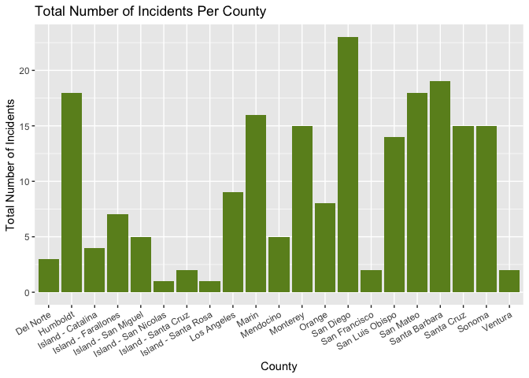
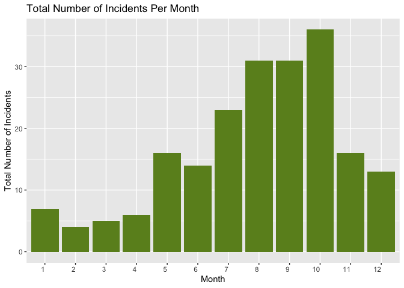
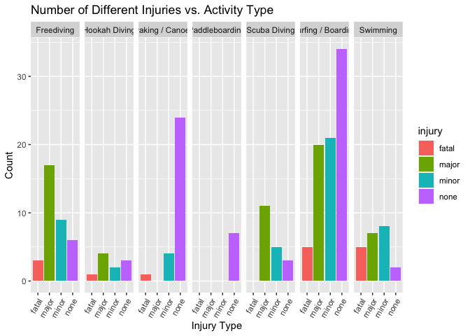
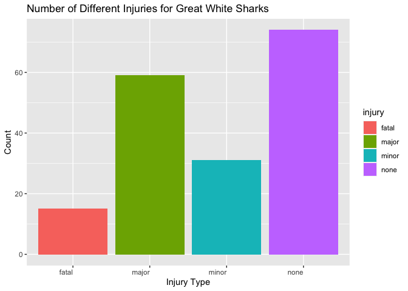
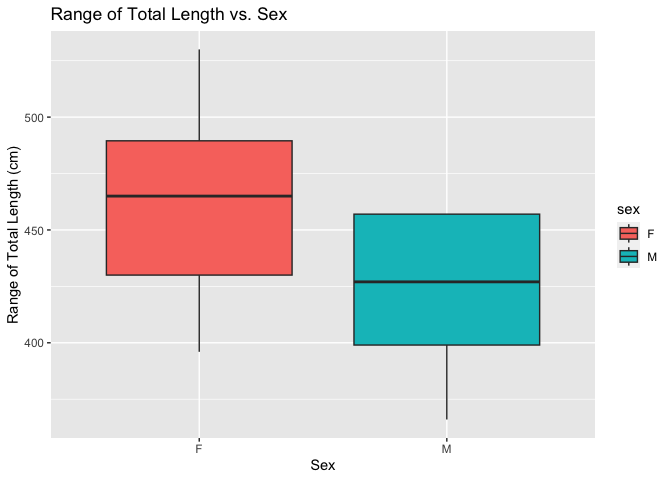

## Instructions
Answer the following questions and complete the exercises in RMarkdown. Please embed all of your code and push your final work to your repository. Your code must be organized, clean, and run free from errors. Remember, you must remove the `#` for any included code chunks to run. Be sure to add your name to the author header above. 

Your code must knit in order to be considered. If you are stuck and cannot answer a question, then comment out your code and knit the document. You may use your notes, labs, and homework to help you complete this exam. Do not use any other resources- including AI assistance.  

Don't forget to answer any questions that are asked in the prompt. Some questions will require a plot, but others do not- make sure to read each question carefully.  

For the questions that require a plot, make sure to have clearly labeled axes and a title. Keep your plots clean and professional-looking, but you are free to add color and other aesthetics.  

Be sure to follow the directions and upload your exam on Gradescope.    

## Background
In the `data` folder, you will find data about shark incidents in California between 1950-2022. The [data](https://catalog.data.gov/dataset/shark-incident-database-california-56167) are from: State of California- Shark Incident Database.   

## Load the libraries

```r
library("tidyverse")
library("janitor")
library("naniar")
```

## Load the data
Run the following code chunk to import the data.

```r
sharks <- read_csv("data/SharkIncidents_1950_2022_220302.csv") %>% clean_names()
```

## Questions
1. (1 point) Start by doing some data exploration using your preferred function(s). What is the structure of the data? Where are the missing values and how are they represented?  

The data is mostly made up of categorical variables. There are missing values in 'wfl_case_number' and they are represented as 'NA'

```r
glimpse(sharks)
```

```
## Rows: 211
## Columns: 16
## $ incident_num     <chr> "1", "2", "3", "4", "5", "6", "7", "8", "9", "10", "1…
## $ month            <dbl> 10, 5, 12, 2, 8, 4, 10, 5, 6, 7, 10, 11, 4, 5, 5, 8, …
## $ day              <dbl> 8, 27, 7, 6, 14, 28, 12, 7, 14, 28, 4, 10, 24, 19, 21…
## $ year             <dbl> 1950, 1952, 1952, 1955, 1956, 1957, 1958, 1959, 1959,…
## $ time             <chr> "12:00", "14:00", "14:00", "12:00", "16:30", "13:30",…
## $ county           <chr> "San Diego", "San Diego", "Monterey", "Monterey", "Sa…
## $ location         <chr> "Imperial Beach", "Imperial Beach", "Lovers Point", "…
## $ mode             <chr> "Swimming", "Swimming", "Swimming", "Freediving", "Sw…
## $ injury           <chr> "major", "minor", "fatal", "minor", "major", "fatal",…
## $ depth            <chr> "surface", "surface", "surface", "surface", "surface"…
## $ species          <chr> "White", "White", "White", "White", "White", "White",…
## $ comment          <chr> "Body Surfing, bit multiple times on leg, thigh and b…
## $ longitude        <chr> "-117.1466667", "-117.2466667", "-122.05", "-122.15",…
## $ latitude         <dbl> 32.58833, 32.58833, 36.62667, 36.62667, 35.13833, 35.…
## $ confirmed_source <chr> "Miller/Collier, Coronado Paper, Oceanside Paper", "G…
## $ wfl_case_number  <chr> NA, NA, NA, NA, NA, NA, NA, NA, NA, NA, NA, NA, NA, N…
```

```r
summary(sharks)
```

```
##  incident_num           month             day             year     
##  Length:211         Min.   : 1.000   Min.   : 1.00   Min.   :1950  
##  Class :character   1st Qu.: 6.000   1st Qu.: 7.50   1st Qu.:1985  
##  Mode  :character   Median : 8.000   Median :18.00   Median :2004  
##                     Mean   : 7.858   Mean   :16.54   Mean   :1998  
##                     3rd Qu.:10.000   3rd Qu.:25.00   3rd Qu.:2014  
##                     Max.   :12.000   Max.   :31.00   Max.   :2022  
##                                                                    
##      time              county            location             mode          
##  Length:211         Length:211         Length:211         Length:211        
##  Class :character   Class :character   Class :character   Class :character  
##  Mode  :character   Mode  :character   Mode  :character   Mode  :character  
##                                                                             
##                                                                             
##                                                                             
##                                                                             
##     injury             depth             species            comment         
##  Length:211         Length:211         Length:211         Length:211        
##  Class :character   Class :character   Class :character   Class :character  
##  Mode  :character   Mode  :character   Mode  :character   Mode  :character  
##                                                                             
##                                                                             
##                                                                             
##                                                                             
##   longitude            latitude     confirmed_source   wfl_case_number   
##  Length:211         Min.   :32.59   Length:211         Length:211        
##  Class :character   1st Qu.:34.04   Class :character   Class :character  
##  Mode  :character   Median :36.70   Mode  :character   Mode  :character  
##                     Mean   :36.36                                        
##                     3rd Qu.:38.18                                        
##                     Max.   :41.56                                        
##                     NA's   :6
```


2. (1 point) Notice that there are some incidents identified as "NOT COUNTED". These should be removed from the data because they were either not sharks, unverified, or were provoked. It's OK to replace the `sharks` object.

```r
sharks_new <- sharks %>% 
  filter(incident_num!="NOT COUNTED") 
```


3. (3 points) Are there any "hotspots" for shark incidents in California? Make a plot that shows the total number of incidents per county. Which county has the highest number of incidents?

San Diego County has the highest number of incidents.

```r
sharks_new %>% 
  group_by(county) %>% 
  summarise(total_incidents=n_distinct(incident_num)) %>% 
  ggplot(aes(x=county, y=total_incidents))+
  geom_col(fill="olivedrab")+
  theme(axis.text.x = element_text(angle=30, hjust=1))+
  labs(title = "Total Number of Incidents Per County",
       x= "County",
       y="Total Number of Incidents")
```

<!-- -->


4. (3 points) Are there months of the year when incidents are more likely to occur? Make a plot that shows the total number of incidents by month. Which month has the highest number of incidents?  

October (10) has the highest number of incidents.

```r
sharks_new %>% 
  mutate(month=as.factor(month)) %>% 
  group_by(month) %>% 
  summarise(total_incidents=n_distinct(incident_num)) %>% 
  ggplot(aes(x=month, y=total_incidents))+
  geom_col(fill="olivedrab")+
  theme(axis.text.x = element_text(hjust=1))+
  labs(title = "Total Number of Incidents Per Month",
       x= "Month",
       y="Total Number of Incidents")
```

<!-- -->


5. (3 points) How do the number and types of injuries compare by county? Make a table (not a plot) that shows the number of injury types by county. Which county has the highest number of fatalities? 

```r
sharks_new %>% 
  group_by(county) %>%
select(injury, county) %>% 
  summarise(number_of_injuries=n_distinct(injury)) %>% 
  arrange(desc(number_of_injuries))
```

```
## # A tibble: 21 × 2
##    county              number_of_injuries
##    <chr>                            <int>
##  1 Monterey                             4
##  2 San Diego                            4
##  3 San Luis Obispo                      4
##  4 San Mateo                            4
##  5 Santa Barbara                        4
##  6 Santa Cruz                           4
##  7 Humboldt                             3
##  8 Island - San Miguel                  3
##  9 Los Angeles                          3
## 10 Marin                                3
## # ℹ 11 more rows
```

```r
sharks_new %>% 
  group_by(county) %>%
select( county, injury)
```

```
## # A tibble: 202 × 2
## # Groups:   county [21]
##    county          injury
##    <chr>           <chr> 
##  1 San Diego       major 
##  2 San Diego       minor 
##  3 Monterey        fatal 
##  4 Monterey        minor 
##  5 San Luis Obispo major 
##  6 San Luis Obispo fatal 
##  7 San Diego       major 
##  8 San Francisco   fatal 
##  9 San Diego       fatal 
## 10 San Diego       minor 
## # ℹ 192 more rows
```

```r
#sharks_new %>% 
#  filter(injury=="fatal") %>% 
#  group_by(county) %>% 
  ##?
```


6. (2 points) In the data, `mode` refers to a type of activity. Which activity is associated with the highest number of incidents?

Surfing/Boarding is associated with the highest number of incidents.

```r
sharks_new %>% 
  group_by(mode) %>% 
  select(mode, incident_num) %>% 
  summarise(highest_amount_incidents=n_distinct(incident_num)) %>% 
  arrange(desc(highest_amount_incidents))
```

```
## # A tibble: 7 × 2
##   mode                highest_amount_incidents
##   <chr>                                  <int>
## 1 Surfing / Boarding                        80
## 2 Freediving                                35
## 3 Kayaking / Canoeing                       29
## 4 Swimming                                  22
## 5 Scuba Diving                              19
## 6 Hookah Diving                             10
## 7 Paddleboarding                             7
```


7. (4 points) Use faceting to make a plot that compares the number and types of injuries by activity. (hint: the x axes should be the type of injury) 

```r
sharks_new %>% 
  ggplot(aes(x=injury, group=injury, fill=injury))+
  geom_bar(position = "dodge")+
  facet_grid(.~mode)+
  theme(axis.text.x = element_text(angle=60, hjust=1))+
  labs(title= "Number of Different Injuries vs. Activity Type",
       x="Injury Type",
       y="Count")
```

<!-- -->

```r
?facet_grid
```


8. (1 point) Which shark species is involved in the highest number of incidents? 

The White Shark species is involved in the highest number of incidents.

```r
sharks_new %>% 
  group_by(species) %>% 
  select(species, incident_num) %>% 
  summarise(most_incidents=n_distinct(incident_num)) %>% 
  arrange(desc(most_incidents))
```

```
## # A tibble: 8 × 2
##   species    most_incidents
##   <chr>               <int>
## 1 White                 179
## 2 Unknown                13
## 3 Hammerhead              3
## 4 Blue                    2
## 5 Leopard                 2
## 6 Salmon                  1
## 7 Sevengill               1
## 8 Thresher                1
```


9. (3 points) Are all incidents involving Great White's fatal? Make a plot that shows the number and types of injuries for Great White's only.

No, not all incidents involving great whites are fatal- infact the least amount of incidents are fatal compared to others.

```r
sharks_new %>% 
  filter(species=="White") %>% 
  select(species, injury) %>% 
  ggplot(aes(x=injury, group=injury, fill=injury))+
  geom_bar(position = "dodge")+
  theme(axis.text.x = element_text(hjust=1))+
  labs(title= "Number of Different Injuries for Great White Sharks",
       x="Injury Type",
       y="Count")
```

<!-- -->


## Background
Let's learn a little bit more about Great White sharks by looking at a small dataset that tracked 20 Great White's in the Fallaron Islands. The [data](https://link.springer.com/article/10.1007/s00227-007-0739-4) are from: Weng et al. (2007) Migration and habitat of white sharks (_Carcharodon carcharias_) in the eastern Pacific Ocean.

## Load the data

```r
white_sharks <- read_csv("data/White sharks tracked from Southeast Farallon Island, CA, USA, 1999 2004.csv", na = c("?", "n/a")) %>% clean_names()
```

10. (1 point) Start by doing some data exploration using your preferred function(s). What is the structure of the data? Where are the missing values and how are they represented?

The data is promarily made up of discrete variables and appears to be in a long format. There are missing values in the variable sex, represented as 'NA'

```r
glimpse(white_sharks)
```

```
## Rows: 20
## Columns: 10
## $ shark           <chr> "1-M", "2-M", "3-M", "4-M", "5-F", "6-M", "7-F", "8-M"…
## $ tagging_date    <chr> "19-Oct-99", "30-Oct-99", "16-Oct-00", "5-Nov-01", "5-…
## $ total_length_cm <dbl> 402, 366, 457, 457, 488, 427, 442, 380, 450, 530, 427,…
## $ sex             <chr> "M", "M", "M", "M", "F", "M", "F", "M", "M", "F", NA, …
## $ maturity        <chr> "Mature", "Adolescent", "Mature", "Mature", "Mature", …
## $ pop_up_date     <chr> "2-Nov-99", "25-Nov-99", "16-Apr-01", "6-May-02", "19-…
## $ track_days      <dbl> 14, 26, 182, 182, 256, 275, 35, 60, 209, 91, 182, 240,…
## $ longitude       <dbl> -124.49, -125.97, -156.80, -141.47, -133.25, -138.83, …
## $ latitude        <dbl> 38.95, 38.69, 20.67, 26.39, 21.13, 26.50, 37.07, 34.93…
## $ comment         <chr> "Nearshore", "Nearshore", "To Hawaii", "To Hawaii", "O…
```

```r
summary(white_sharks)
```

```
##     shark           tagging_date       total_length_cm     sex           
##  Length:20          Length:20          Min.   :360.0   Length:20         
##  Class :character   Class :character   1st Qu.:400.5   Class :character  
##  Mode  :character   Mode  :character   Median :434.5   Mode  :character  
##                                        Mean   :436.1                     
##                                        3rd Qu.:457.0                     
##                                        Max.   :530.0                     
##                                                                          
##    maturity         pop_up_date          track_days      longitude     
##  Length:20          Length:20          Min.   : 14.0   Min.   :-156.8  
##  Class :character   Class :character   1st Qu.: 85.0   1st Qu.:-137.8  
##  Mode  :character   Mode  :character   Median :182.0   Median :-133.2  
##                                        Mean   :166.8   Mean   :-120.3  
##                                        3rd Qu.:216.8   3rd Qu.:-124.3  
##                                        Max.   :367.0   Max.   : 131.7  
##                                                        NA's   :1       
##     latitude       comment         
##  Min.   :20.67   Length:20         
##  1st Qu.:22.48   Class :character  
##  Median :26.39   Mode  :character  
##  Mean   :28.24                     
##  3rd Qu.:36.00                     
##  Max.   :38.95                     
##  NA's   :1
```


11. (3 points) How do male and female sharks compare in terms of total length? Are males or females larger on average? Do a quick search online to verify your findings. (hint: this is a table, not a plot).  

Females are larger in length on average.

```r
white_sharks %>% 
  filter(sex=="F"|sex=="M") %>% 
  group_by(sex) %>% 
  summarise(average_length=mean(total_length_cm))
```

```
## # A tibble: 2 × 2
##   sex   average_length
##   <chr>          <dbl>
## 1 F               462 
## 2 M               425.
```


12. (3 points) Make a plot that compares the range of total length by sex.

```r
white_sharks %>% 
  filter(sex=="F"|sex=="M") %>% 
  group_by(sex) %>% 
  ggplot(aes(x=sex, y=total_length_cm, group=sex, fill=sex))+
  geom_boxplot()+
  labs(title = "Range of Total Length vs. Sex",
       x="Sex",
       y="Range of Total Length (cm)")
```

<!-- -->


13. (2 points) Using the `sharks` or the `white_sharks` data, what is one question that you are interested in exploring? Write the question and answer it using a plot or table.  

What species of shark has caused the most injuries in Santa Cruz County?

White sharks have caused the most injuries in Santa Cruz County.

```r
sharks_new %>% 
  filter(county=="Santa Cruz") %>% 
  group_by(species) %>% 
  summarise(injuries_count=n_distinct(injury))
```

```
## # A tibble: 2 × 2
##   species injuries_count
##   <chr>            <int>
## 1 Unknown              1
## 2 White                4
```
What years has the highest number of injuries?

2004, 2012, and 2021 have the highest humber of injuries, being 4.

```r
sharks_new %>% 
  group_by(year) %>% 
  summarise(injuries_count=n_distinct(injury)) %>% 
  arrange(desc(injuries_count))
```

```
## # A tibble: 63 × 2
##     year injuries_count
##    <dbl>          <int>
##  1  2004              4
##  2  2012              4
##  3  2021              4
##  4  1959              3
##  5  1982              3
##  6  1984              3
##  7  1990              3
##  8  1996              3
##  9  2005              3
## 10  2007              3
## # ℹ 53 more rows
```


